<p align="center">
  <a href="http://nestjs.com/" target="blank"></a>
</p>

[circleci-image]: https://img.shields.io/circleci/build/github/nestjs/nest/master?token=abc123def456
[circleci-url]: https://circleci.com/gh/nestjs/nest

  <p align="center">Todo Application using NestJS</p>
    <p align="center">
<a href="https://www.npmjs.com/~nestjscore" target="_blank"></a>
<a href="https://www.npmjs.com/~nestjscore" target="_blank"></a>
<a href="https://www.npmjs.com/~nestjscore" target="_blank"></a>
<a href="https://circleci.com/gh/nestjs/nest" target="_blank"></a>
<a href="https://coveralls.io/github/nestjs/nest?branch=master" target="_blank"></a>
<a href="https://discord.gg/G7Qnnhy" target="_blank"></a>
<a href="https://opencollective.com/nest#backer" target="_blank"></a>
<a href="https://opencollective.com/nest#sponsor" target="_blank"></a>
  <a href="https://paypal.me/kamilmysliwiec" target="_blank"></a>
    <a href="https://opencollective.com/nest#sponsor"  target="_blank"></a>
  <a href="https://twitter.com/nestframework" target="_blank"></a>
</p>
  <!--[](https://opencollective.com/nest#backer)
  [](https://opencollective.com/nest#sponsor)-->

## Description

Todo Application using NestJS, PostgreSQL with User Authentication and JWT Authentication and Swagger Docs

## Environment Variables

```
.env file

DATABASE_HOST
DATABASE_PORT
DATABASE_USERNANE
DATABASE_PASSWORD
DATABASE_NAME

JWT_KEY
JWT_EXPIRE

PORT
```

## Installation

```bash
$ npm install
```

## Running the app

```bash
# development
$ npm run start

# watch mode
$ npm run start:dev

# production mode
$ npm run start:prod
```

## Test

```bash
# unit tests
$ npm run test

# e2e tests
$ npm run test:e2e

# test coverage
$ npm run test:cov
```

## Support

Nest is an MIT-licensed open source project. It can grow thanks to the sponsors and support by the amazing backers. If you'd like to join them, please [read more here](https://docs.nestjs.com/support).

# Screenshots

<details>
  <summary>User Signup</summary>

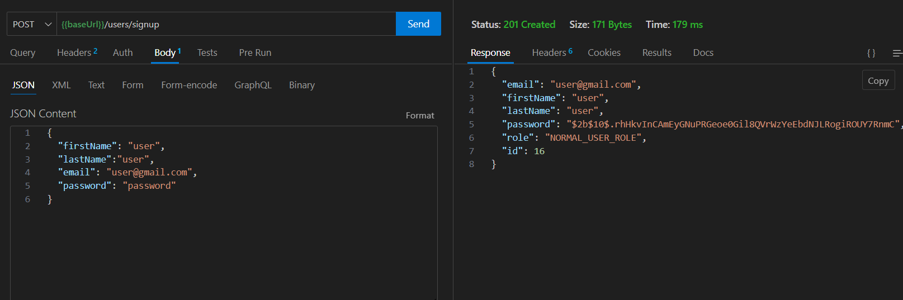

### Duplicate email

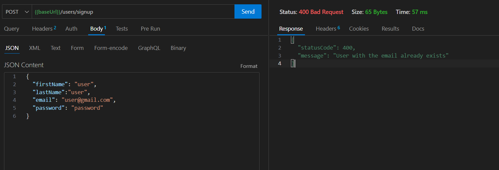

</details>

<details>
  <summary>User Login</summary>

### Correct Password

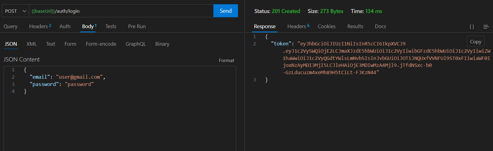

### Incorrect Password

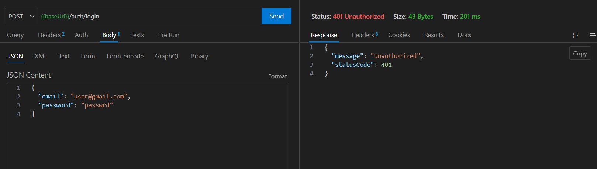

</details>

<details>
  <summary>Get List of users / Delete</summary>

### Normal User

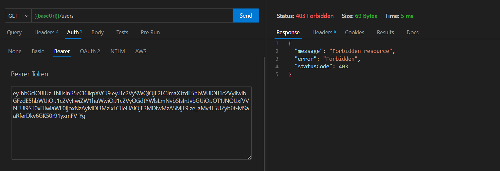

### Admin

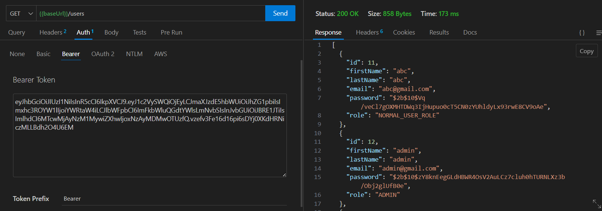

</details>

<details>
  <summary>Create new todo</summary>

### Creates new todo for the user by extracting user id from the JWT token in header

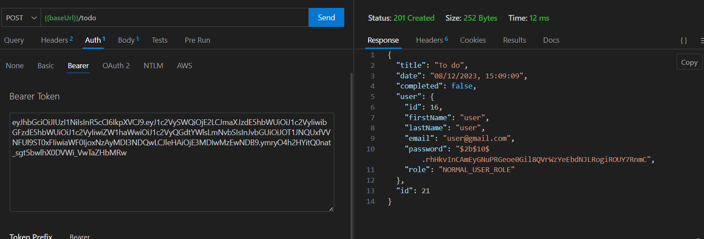

</details>

<details>
  <summary>Uncompleted todos</summary>

### List of uncompleted todos for the user by extracting user id from the JWT token in header

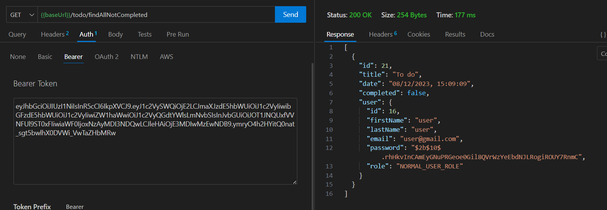

</details>

<details>
  <summary>Complete the todo</summary>

### Unauthorized if another user tries to mark the todo as complete

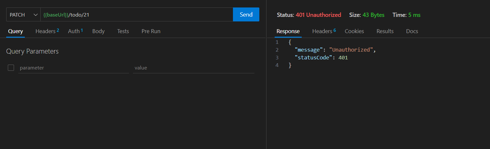

### Mark the todo complete

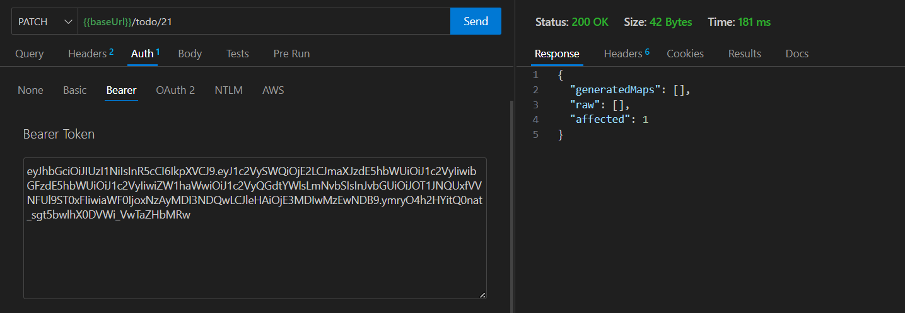

</details>

<details>
  <summary>Completed todos</summary>

### List of completed todos for the user by extracting user id from the JWT token in header

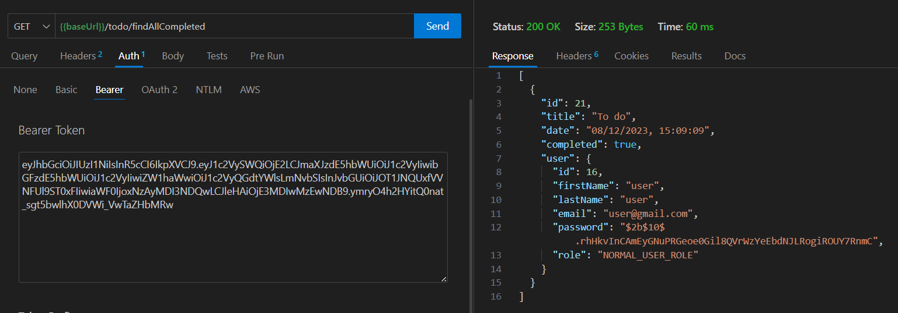

</details>

<details>
  <summary>Delete todo</summary>
  
  ### Unauthorized if another user tries to delete the todo
  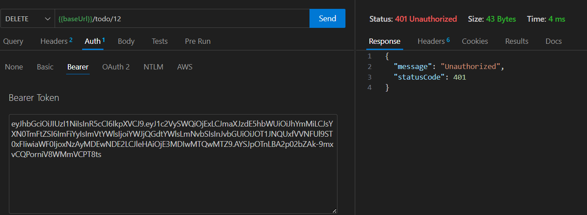
  ### Delete todo
  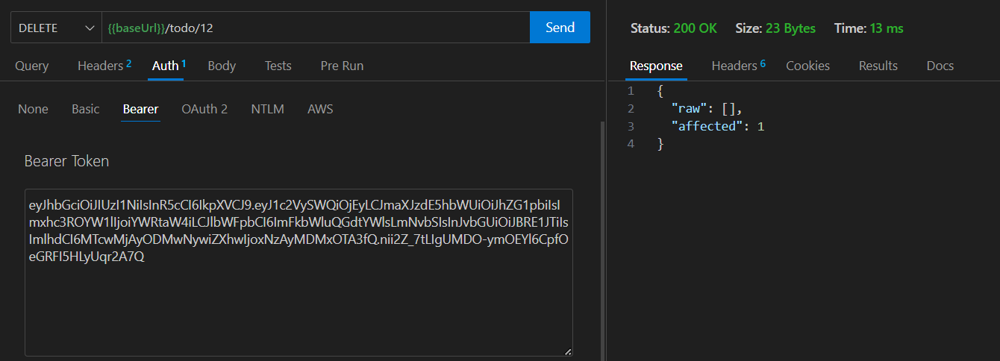
</details>
